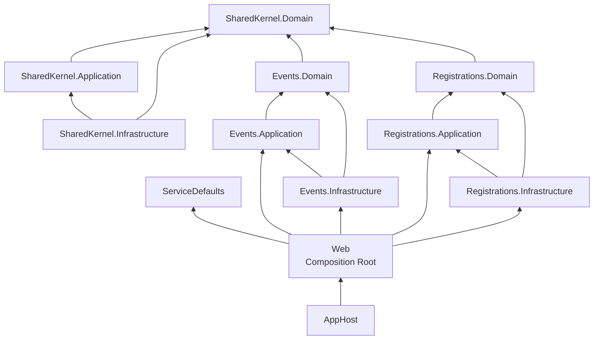
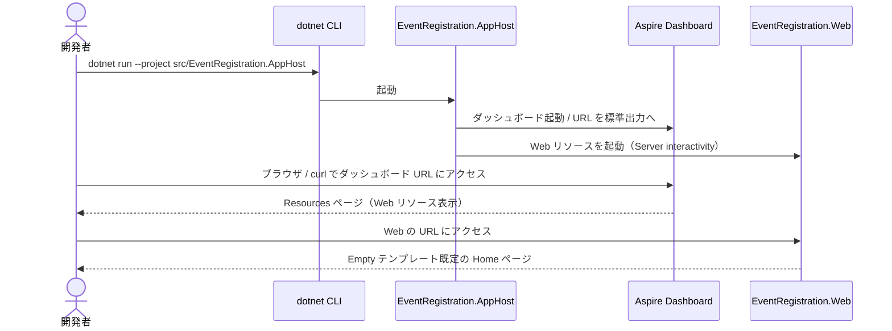

# アーキテクチャ設計

> 対象: イベント参加登録システム基盤（SPEC: [event-registration-system-spec.md](./event-registration-system-spec.md) / Issue: [#1](https://github.com/runceel/ai-dev-dotnetapp/issues/1)）
> ステータス: **骨子（Phase 2 / Step 2.2.5）**。詳細は実装完了後（Phase 3 / Step 3.4.5）に追記する。

---

## 概要

本ドキュメントは、イベント参加登録システムの **基盤プロジェクト構造**（空ソリューション + 12 プロジェクト）の設計を定義する。Modular Monolith × Clean Architecture を採用し、モジュール境界をプロジェクト境界として物理的に強制する。.NET Aspire により AppHost からの起動と観測性を最初から確保する Walking Skeleton である。

### 主要なポイント

| 項目 | 内容 |
|------|------|
| ランタイム | .NET 10（`net10.0`） |
| アーキテクチャスタイル | Modular Monolith + Clean Architecture（モジュール単位適用） |
| 構成モジュール | `SharedKernel` / `Events` / `Registrations` |
| 各モジュールのレイヤー | `Domain` / `Application` / `Infrastructure` の 3 プロジェクト |
| ホスト系 | `AppHost`（Aspire）/ `ServiceDefaults` / `Web`（Blazor Web App: Server interactivity / Empty） |
| プロジェクト総数 | 12（ホスト 3 + モジュール 9） |
| Composition Root | `EventRegistration.Web` の `Program.cs` |
| ソリューションファイル形式 | `.sln`（クラシック形式） |

### 関連ドキュメント

- 仕様: [event-registration-system-spec.md](./event-registration-system-spec.md)
- 設計方針コメント（Architect / Step 2.1）: Issue #1 [comment-id: 4311059746](https://github.com/runceel/ai-dev-dotnetapp/issues/1#issuecomment-4311059746)
- 実装計画コメント（Developer / Step 2.2）: Issue #1 [comment-id: 4311073160](https://github.com/runceel/ai-dev-dotnetapp/issues/1#issuecomment-4311073160)

---

## 1. ディレクトリ構成

```
ai-dev-dotnetapp/
├── EventRegistration.sln
└── src/
    ├── EventRegistration.AppHost/              # Aspire AppHost（オーケストレーション）
    ├── EventRegistration.ServiceDefaults/      # 観測性・ヘルスチェック等の共通設定
    ├── EventRegistration.Web/                  # Blazor Web App + Composition Root
    └── Modules/
        ├── SharedKernel/
        │   ├── EventRegistration.SharedKernel.Domain/
        │   ├── EventRegistration.SharedKernel.Application/
        │   └── EventRegistration.SharedKernel.Infrastructure/
        ├── Events/
        │   ├── EventRegistration.Events.Domain/
        │   ├── EventRegistration.Events.Application/
        │   └── EventRegistration.Events.Infrastructure/
        └── Registrations/
            ├── EventRegistration.Registrations.Domain/
            ├── EventRegistration.Registrations.Application/
            └── EventRegistration.Registrations.Infrastructure/
```

ソリューションフォルダ階層（`.sln` 内、IDE 表示用）:

```
EventRegistration.sln
├── Hosting
│     ├── EventRegistration.AppHost
│     ├── EventRegistration.ServiceDefaults
│     └── EventRegistration.Web
└── Modules
      ├── SharedKernel
      │     ├── EventRegistration.SharedKernel.Domain
      │     ├── EventRegistration.SharedKernel.Application
      │     └── EventRegistration.SharedKernel.Infrastructure
      ├── Events
      │     ├── EventRegistration.Events.Domain
      │     ├── EventRegistration.Events.Application
      │     └── EventRegistration.Events.Infrastructure
      └── Registrations
            ├── EventRegistration.Registrations.Domain
            ├── EventRegistration.Registrations.Application
            └── EventRegistration.Registrations.Infrastructure
```

---

## 2. 各レイヤー / プロジェクトの責務

### 2.1 ホスト系プロジェクト

| プロジェクト | 種別 | 責務 |
|---|---|---|
| `EventRegistration.AppHost` | Aspire AppHost | 全リソース（現状は `Web` のみ）の登録とローカル起動。Aspire ダッシュボードのホスト |
| `EventRegistration.ServiceDefaults` | クラスライブラリ（Aspire テンプレート） | OpenTelemetry / ヘルスチェック / サービスディスカバリ等の共通設定を `AddServiceDefaults()` / `MapDefaultEndpoints()` として提供。テンプレート出力を改変しない |
| `EventRegistration.Web` | Blazor Web App（Server interactivity / Empty） | フロントエンド + **Composition Root**。`Program.cs` で `AddServiceDefaults()` を呼び出し、各業務モジュールの Application + Infrastructure を DI 登録する唯一の場所 |

### 2.2 モジュール系プロジェクト（共通パターン）

| レイヤー | 責務 | 本仕様時点の状態 |
|---|---|---|
| `<Module>.Domain` | エンティティ・値オブジェクト・ドメインサービス・ドメイン例外。フレームワーク非依存 | 空（`Class1.cs` 削除 + `.gitkeep` のみ） |
| `<Module>.Application` | UseCase / アプリケーションサービス / 抽象（Repository インターフェース等） | 空（同上） |
| `<Module>.Infrastructure` | 永続化・外部 API・メッセージング等の具象実装 | 空（同上） |

### 2.3 モジュール別の位置づけ

| モジュール | 位置づけ |
|---|---|
| `SharedKernel` | 複数モジュールから利用される共通プリミティブを配置する **最下層モジュール**。他の業務モジュールに一切依存しない |
| `Events` | イベント（開催情報）に関する Bounded Context（業務実装は Phase 2 以降） |
| `Registrations` | 参加登録に関する Bounded Context（業務実装は Phase 2 以降） |

---

## 3. プロジェクト参照方向（依存グラフ）

### 3.1 全体依存グラフ



矢印は `<ProjectReference>` の方向（参照元 → 参照先）。

### 3.2 必須参照一覧（本仕様時点）

| 参照元 | 参照先 | 根拠 |
|---|---|---|
| `<Module>.Application` | `<Module>.Domain` | REQ-006 |
| `<Module>.Infrastructure` | `<Module>.Application` | REQ-006 |
| `<Module>.Infrastructure` | `<Module>.Domain` | REQ-006（推移的だが明示） |
| `Events.Domain` | `SharedKernel.Domain` | REQ-006 / AC-015 |
| `Registrations.Domain` | `SharedKernel.Domain` | REQ-006 / AC-015 |
| `SharedKernel.Application` | `SharedKernel.Domain` | REQ-006 |
| `SharedKernel.Infrastructure` | `SharedKernel.Application` | REQ-006 |
| `SharedKernel.Infrastructure` | `SharedKernel.Domain` | REQ-006 |
| `EventRegistration.Web` | `EventRegistration.ServiceDefaults` | REQ-005 |
| `EventRegistration.Web` | `Events.Application` / `Events.Infrastructure` | REQ-006 |
| `EventRegistration.Web` | `Registrations.Application` / `Registrations.Infrastructure` | REQ-006 |
| `EventRegistration.AppHost` | `EventRegistration.Web`（`IsAspireProjectResource="true"`） | REQ-004 |

> 本仕様時点では `SharedKernel.Application` / `SharedKernel.Infrastructure` への業務モジュールからの参照は **追加しない**（YAGNI、Architect §2.2）。Web からの SharedKernel 明示参照も追加しない（推移取得）。

### 3.3 禁止参照（CON-007 / CON-008）

- `Events.* ↔ Registrations.*` の双方向参照（業務モジュール間の直接参照禁止）
- `SharedKernel.* → Events.* / Registrations.*` の参照（SharedKernel は最下層）
- `SharedKernel.Domain` からの一切の他プロジェクト参照（参照ゼロを維持）

検証: `dotnet list reference` の出力に上記禁止参照が含まれないこと（Step 2.5 / 3.x で機械的に確認）。

---

## 4. 起動・実行モデル



---

## 5. 設計上の制約 / 不変条件

| ID | 制約 | 強制方法 |
|---|---|---|
| CON-001 | 全プロジェクトの TFM は `net10.0` | `dotnet new ... -f net10.0` 統一 |
| CON-002 | Web は Blazor Web App（Server interactivity / Empty） | `dotnet new blazor --interactivity Server --empty` |
| CON-005 | 追加 NuGet パッケージは導入しない | テンプレート既定参照のみ |
| CON-007 | `SharedKernel.Domain` は参照ゼロ | `dotnet list reference` 確認 |
| CON-008 | 業務モジュール間の直接参照禁止 | `dotnet list reference` 確認 |
| CON-009 | モジュール系プロジェクトを Aspire リソースとして登録しない | AppHost コードレビュー |

---

## 6. 拡張性（新モジュール追加手順）

1. `src/Modules/<NewModuleName>/` 配下に Domain / Application / Infrastructure の 3 プロジェクトを作成
2. ソリューションフォルダ `Modules/<NewModuleName>` を新設し、3 プロジェクトを登録
3. `<NewModuleName>.Domain` から `SharedKernel.Domain` への参照を追加（必要時）
4. レイヤー間参照（Application → Domain、Infrastructure → Application/Domain）を追加
5. `EventRegistration.Web` から `<NewModuleName>.Application` と `<NewModuleName>.Infrastructure` への参照を追加
6. **他の業務モジュールへの直接参照を追加しない**（CON-008）

詳細は SPEC GUD-002 に従う。

---

## 7. TODO（Phase 3 / Step 3.4.5 で追記予定）

- [ ] 実装後の `csproj` のリンク（各プロジェクトへの相対リンク）
- [ ] 実際の `dotnet build` 警告サマリ（CON-006 対応の記録）
- [ ] `EventRegistration.AppHost/Program.cs` の最終コード抜粋
- [ ] `EventRegistration.Web/Program.cs` の `AddServiceDefaults()` / `MapDefaultEndpoints()` 統合行の最終形
- [ ] 起動時に観測されたダッシュボード URL の例 / Resources ページのスクリーンショット相当の説明
- [ ] 検証コマンドのコピー&ペースト用ブロック（`dotnet build` / `dotnet run` / 禁止参照確認スクリプト）
