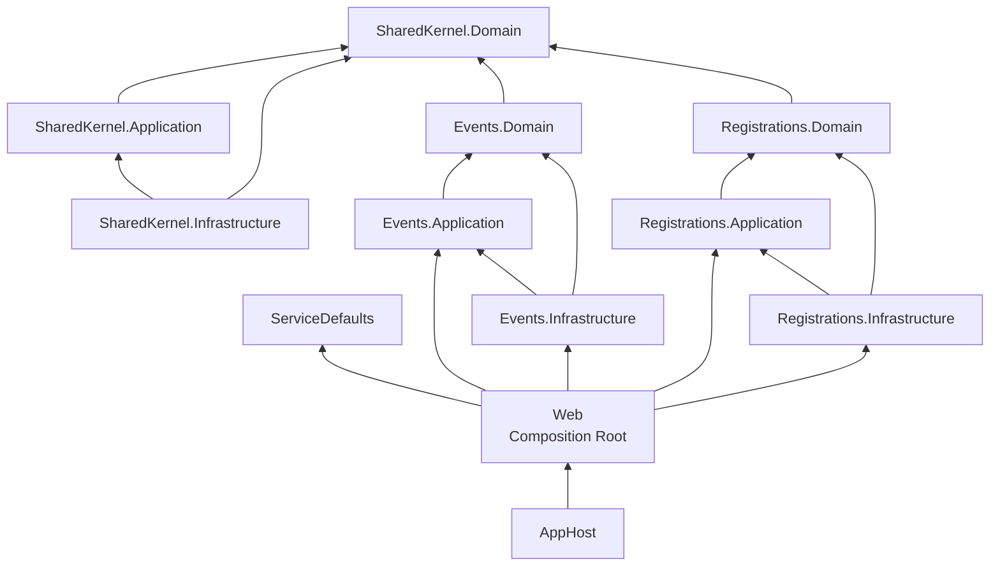
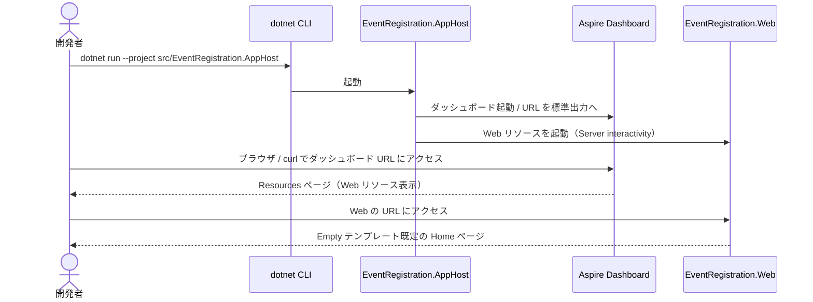
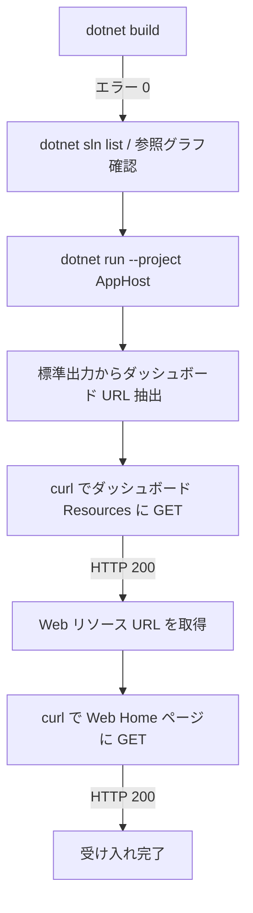

# アーキテクチャ設計

> 対象: イベント参加登録システム基盤（SPEC: [event-registration-system-spec.md](./event-registration-system-spec.md) / Issue: [#1](https://github.com/runceel/ai-dev-dotnetapp/issues/1) / PR: [#2](https://github.com/runceel/ai-dev-dotnetapp/pull/2)）
> ステータス: **実装反映済み（Phase 3 / Step 3.4.5）**。`feature/1-bootstrap-solution` ブランチでビルド成功済み（エラー 0 / 警告 0）。
>
> **更新（Issue #3 / UI Shell）**: MudBlazor ベースの UI Shell とナビゲーション Self-Registration 機構の導入に伴い、§1 ディレクトリ構成と本ドキュメント末尾の「UI Shell 導入差分」セクションを更新。Shell 実装の詳細は [ui-shell-design.md](./ui-shell-design.md) を参照。

---

## 概要

本ドキュメントは、イベント参加登録システムの **基盤プロジェクト構造**（空ソリューション + 12 プロジェクト）の設計を定義する。Modular Monolith × Clean Architecture を採用し、モジュール境界をプロジェクト境界として物理的に強制する。.NET Aspire により AppHost からの起動と観測性を最初から確保する Walking Skeleton である。

### 主要なポイント

| 項目 | 内容 |
|------|------|
| ランタイム | .NET 10（`net10.0`） |
| アーキテクチャスタイル | Modular Monolith + Clean Architecture（モジュール単位適用） |
| 構成モジュール | `SharedKernel` / `Events` / `Registrations` |
| 各モジュールのレイヤー | `Domain` / `Application` / `Infrastructure` の 3 プロジェクト |
| ホスト系 | `AppHost`（Aspire）/ `ServiceDefaults` / `Web`（Blazor Web App: Server interactivity / Empty） |
| プロジェクト総数 | 12（ホスト 3 + モジュール 9） |
| Composition Root | `EventRegistration.Web` の `Program.cs` |
| ソリューションファイル形式 | `.sln`（クラシック形式） |

### 関連ドキュメント

- 仕様: [event-registration-system-spec.md](./event-registration-system-spec.md)
- UI Shell 設計（MudBlazor 基盤 + ナビゲーション Self-Registration）: [ui-shell-design.md](./ui-shell-design.md)
- 設計方針コメント（Architect / Step 2.1）: Issue #1 [comment-id: 4311059746](https://github.com/runceel/ai-dev-dotnetapp/issues/1#issuecomment-4311059746)
- 実装計画コメント（Developer / Step 2.2）: Issue #1 [comment-id: 4311073160](https://github.com/runceel/ai-dev-dotnetapp/issues/1#issuecomment-4311073160)

---

## 1. ディレクトリ構成

```
ai-dev-dotnetapp/
├── EventRegistration.sln                         # クラシック .sln 形式
├── global.json                                   # SDK ピン留め: 10.0.203 (rollForward: latestPatch)
├── README.md
├── docs/
│   ├── architecture.md                           # 本ドキュメント
│   └── event-registration-system-spec.md
└── src/
    ├── EventRegistration.AppHost/                # Aspire AppHost（Aspire.AppHost.Sdk/13.1.0）
    │   ├── AppHost.cs                            # トップレベル文 / Web を AddProject 登録
    │   ├── EventRegistration.AppHost.csproj
    │   ├── Properties/launchSettings.json
    │   ├── appsettings.json
    │   └── appsettings.Development.json
    ├── EventRegistration.ServiceDefaults/        # 観測性・ヘルスチェック等の共通設定（テンプレ既定 / 改変なし）
    │   ├── Extensions.cs                         # AddServiceDefaults / MapDefaultEndpoints
    │   └── EventRegistration.ServiceDefaults.csproj
    ├── EventRegistration.Web/                    # Blazor Web App (Server / Empty) + Composition Root
    │   ├── Program.cs                            # AddServiceDefaults / AddMudServices / AddXxxModuleNavigation / MapDefaultEndpoints
    │   ├── EventRegistration.Web.csproj          # PackageReference: MudBlazor 9.4.0
    │   ├── Components/
    │   │   ├── App.razor / Routes.razor / _Imports.razor
    │   │   ├── Layout/MainLayout.razor (.css) / ReconnectModal.razor (.css/.js)
    │   │   └── Pages/Home.razor / Error.razor / NotFound.razor
    │   ├── Shell/                                # UI Shell（Issue #3 で追加 / 詳細は ui-shell-design.md）
    │   │   ├── Theme/AppTheme.cs                 # MudTheme（.NET ブランドカラー #512BD4）
    │   │   └── Navigation/
    │   │       ├── IconResolver.cs               # アイコンキー → MudBlazor SVG 解決（未知キーは Help へフォールバック）
    │   │       └── NavigationMatchExtensions.cs  # NavigationMatch → NavLinkMatch 変換
    │   ├── wwwroot/app.css
    │   ├── Properties/launchSettings.json
    │   ├── appsettings.json
    │   └── appsettings.Development.json
    └── Modules/
        ├── SharedKernel/
        │   ├── EventRegistration.SharedKernel.Domain/           (.gitkeep)
        │   ├── EventRegistration.SharedKernel.Application/      # Navigation/{INavigationItem,NavigationItem,NavigationMatch}.cs
        │   └── EventRegistration.SharedKernel.Infrastructure/   (.gitkeep)
        ├── Events/
        │   ├── EventRegistration.Events.Domain/                 (.gitkeep)
        │   ├── EventRegistration.Events.Application/            # Navigation/EventsNavigationExtensions.cs（DI 登録拡張）
        │   └── EventRegistration.Events.Infrastructure/         (.gitkeep)
        └── Registrations/
            ├── EventRegistration.Registrations.Domain/          (.gitkeep)
            ├── EventRegistration.Registrations.Application/     # Navigation/RegistrationsNavigationExtensions.cs（DI 登録拡張）
            └── EventRegistration.Registrations.Infrastructure/  (.gitkeep)
```

> 注 1: Web プロジェクトの `Components/` 配下の Razor ファイル（`App.razor` / `Routes.razor` / `Layout/*` / `Pages/{Home,Error,NotFound}.razor` / `wwwroot/app.css`）はすべて `dotnet new blazor --interactivity Server --empty` テンプレートが生成した既定ファイルで、**Counter / Weather などのサンプル UI は含まれない**（AC-011 / Issue #1）。`MainLayout.razor` のみ Issue #3 で MudBlazor ベースに置き換え済み。
>
> 注 2: `Shell/` 配下および各モジュール `Application/Navigation/` 配下のファイルは Issue #3 で追加。Modules 側からは MudBlazor / `EventRegistration.Web` を参照しない（Issue #3 AC-014）。Shell 実装の責務分離・Self-Registration パターンの詳細は [ui-shell-design.md](./ui-shell-design.md) を参照。

### 1.1 追加 NuGet パッケージ（Issue #3）

| プロジェクト | パッケージ | バージョン | 用途 |
|---|---|---|---|
| `EventRegistration.Web` | `MudBlazor` | 9.4.0 | UI コンポーネントライブラリ（AppBar / Drawer / NavLink / Theme） |
| `EventRegistration.Events.Application` | `Microsoft.Extensions.DependencyInjection.Abstractions` | 10.0.0 | `IServiceCollection` 拡張メソッド（`AddEventsModuleNavigation`）の実装に必要な最小依存 |
| `EventRegistration.Registrations.Application` | `Microsoft.Extensions.DependencyInjection.Abstractions` | 10.0.0 | 同上（`AddRegistrationsModuleNavigation`） |

> `SharedKernel.Application` は DI Abstractions を参照しない（純粋な型定義のみ提供 / Issue #3 設計方針）。

ソリューションフォルダ階層（`.sln` 内、IDE 表示用）:

```
EventRegistration.sln
├── Hosting
│     ├── EventRegistration.AppHost
│     ├── EventRegistration.ServiceDefaults
│     └── EventRegistration.Web
└── Modules
      ├── SharedKernel
      │     ├── EventRegistration.SharedKernel.Domain
      │     ├── EventRegistration.SharedKernel.Application
      │     └── EventRegistration.SharedKernel.Infrastructure
      ├── Events
      │     ├── EventRegistration.Events.Domain
      │     ├── EventRegistration.Events.Application
      │     └── EventRegistration.Events.Infrastructure
      └── Registrations
            ├── EventRegistration.Registrations.Domain
            ├── EventRegistration.Registrations.Application
            └── EventRegistration.Registrations.Infrastructure
```

---

## 2. 各レイヤー / プロジェクトの責務

### 2.1 ホスト系プロジェクト

| プロジェクト | 種別 | 責務 |
|---|---|---|
| `EventRegistration.AppHost` | Aspire AppHost | 全リソース（現状は `Web` のみ）の登録とローカル起動。Aspire ダッシュボードのホスト |
| `EventRegistration.ServiceDefaults` | クラスライブラリ（Aspire テンプレート） | OpenTelemetry / ヘルスチェック / サービスディスカバリ等の共通設定を `AddServiceDefaults()` / `MapDefaultEndpoints()` として提供。テンプレート出力を改変しない |
| `EventRegistration.Web` | Blazor Web App（Server interactivity / Empty） | フロントエンド + **Composition Root**。`Program.cs` で `AddServiceDefaults()` を呼び出し、各業務モジュールの Application + Infrastructure を DI 登録する唯一の場所 |

### 2.2 モジュール系プロジェクト（共通パターン）

| レイヤー | 責務 | 本仕様時点の状態 |
|---|---|---|
| `<Module>.Domain` | エンティティ・値オブジェクト・ドメインサービス・ドメイン例外。フレームワーク非依存 | 空（`Class1.cs` 削除 + `.gitkeep` のみ） |
| `<Module>.Application` | UseCase / アプリケーションサービス / 抽象（Repository インターフェース等） | Issue #1 時点では空。Issue #3 で **`SharedKernel.Application` に `Navigation/{INavigationItem,NavigationItem,NavigationMatch}.cs`** を、**`Events.Application` / `Registrations.Application` に `Navigation/<Module>NavigationExtensions.cs`** を追加（UI Shell の Self-Registration 機構） |
| `<Module>.Infrastructure` | 永続化・外部 API・メッセージング等の具象実装 | 空（同上） |

### 2.3 モジュール別の位置づけ

| モジュール | 位置づけ |
|---|---|
| `SharedKernel` | 複数モジュールから利用される共通プリミティブを配置する **最下層モジュール**。他の業務モジュールに一切依存しない |
| `Events` | イベント（開催情報）に関する Bounded Context（業務実装は Phase 2 以降） |
| `Registrations` | 参加登録に関する Bounded Context（業務実装は Phase 2 以降） |

---

## 3. プロジェクト参照方向（依存グラフ）

### 3.1 全体依存グラフ



矢印は `<ProjectReference>` の方向（参照元 → 参照先）。

### 3.2 必須参照一覧（本仕様時点）

| 参照元 | 参照先 | 根拠 |
|---|---|---|
| `<Module>.Application` | `<Module>.Domain` | REQ-006 |
| `<Module>.Infrastructure` | `<Module>.Application` | REQ-006 |
| `<Module>.Infrastructure` | `<Module>.Domain` | REQ-006（推移的だが明示） |
| `Events.Domain` | `SharedKernel.Domain` | REQ-006 / AC-015 |
| `Registrations.Domain` | `SharedKernel.Domain` | REQ-006 / AC-015 |
| `SharedKernel.Application` | `SharedKernel.Domain` | REQ-006 |
| `SharedKernel.Infrastructure` | `SharedKernel.Application` | REQ-006 |
| `SharedKernel.Infrastructure` | `SharedKernel.Domain` | REQ-006 |
| `EventRegistration.Web` | `EventRegistration.ServiceDefaults` | REQ-005 |
| `EventRegistration.Web` | `Events.Application` / `Events.Infrastructure` | REQ-006 |
| `EventRegistration.Web` | `Registrations.Application` / `Registrations.Infrastructure` | REQ-006 |
| `EventRegistration.AppHost` | `EventRegistration.Web`（`IsAspireProjectResource="true"`） | REQ-004 |

> 本仕様時点では `SharedKernel.Application` / `SharedKernel.Infrastructure` への業務モジュールからの参照は **追加しない**（YAGNI、Architect §2.2）。Web からの SharedKernel 明示参照も追加しない（推移取得）。

### 3.3 禁止参照（CON-007 / CON-008）

- `Events.* ↔ Registrations.*` の双方向参照（業務モジュール間の直接参照禁止）
- `SharedKernel.* → Events.* / Registrations.*` の参照（SharedKernel は最下層）
- `SharedKernel.Domain` からの一切の他プロジェクト参照（参照ゼロを維持）

検証: `dotnet list reference` の出力に上記禁止参照が含まれないこと（Step 2.5 / 3.x で機械的に確認）。

---

## 4. 起動・実行モデル



---

## 5. 設計上の制約 / 不変条件（サマリ）

主要な制約のみ列挙する。完全な制約一覧と緩和策・パフォーマンス影響を含む詳細は **§9 リスク・制約・パフォーマンス影響** を参照。

| ID | 制約 | 強制方法 |
|---|---|---|
| CON-001 | 全プロジェクトの TFM は `net10.0` | `dotnet new ... -f net10.0` 統一 |
| CON-002 | Web は Blazor Web App（Server interactivity / Empty） | `dotnet new blazor --interactivity Server --empty` |
| CON-005 | 追加 NuGet パッケージは導入しない（Issue #1 時点） | テンプレート既定参照のみ。**Issue #3 で UI Shell 用に `MudBlazor` / `Microsoft.Extensions.DependencyInjection.Abstractions` を限定的に追加**（§1.1 参照） |
| CON-007 | `SharedKernel.Domain` は参照ゼロ | `dotnet list reference` 確認 |
| CON-008 | 業務モジュール間の直接参照禁止 | `dotnet list reference` 確認 |
| CON-009 | モジュール系プロジェクトを Aspire リソースとして登録しない | AppHost コードレビュー |

---

## 6. API 変更

**本フェーズでは業務 API（HTTP エンドポイント / 公開型 / DTO）の新規作成・変更は一切行わない。**

| 観点 | 内容 |
|---|---|
| 新規 HTTP エンドポイント | なし（業務機能は Out of Scope / SPEC §1） |
| 既存 HTTP エンドポイントの変更 | なし（既存実装が存在しない） |
| 公開型 / DTO / Contract の追加 | なし（モジュール系 9 プロジェクトはすべて空） |
| SharedKernel への型追加 | なし（`Result<T>` / `Entity` 等の具象型は SPEC §1 Out of Scope）|
| 唯一のランタイム挙動 | (1) Aspire ダッシュボードの起動と URL 出力、(2) Blazor Web App テンプレート既定の Home ページ配信、(3) ServiceDefaults 由来のヘルスチェック / メトリクスエンドポイント（テンプレート既定挙動）|

業務 API の設計は Phase 2 以降の各機能 Issue で別途定義する。

---

## 7. 影響モジュール・レイヤー一覧

本 Issue（#1）で新規作成・変更されるモジュール / プロジェクトの一覧。**既存コード変更はゼロ**（すべて新規作成）。

| 区分 | モジュール | レイヤー / プロジェクト | 変更種別 | 主な変更内容 |
|---|---|---|---|---|
| Hosting | — | `EventRegistration.AppHost` | 新規 | Aspire AppHost テンプレートで生成。`Web` を `AddProject<>()` でリソース登録 |
| Hosting | — | `EventRegistration.ServiceDefaults` | 新規 | Aspire ServiceDefaults テンプレートで生成。改変なし |
| Hosting | — | `EventRegistration.Web` | 新規 | Blazor Web App（Server / Empty）テンプレートで生成。`Program.cs` に `AddServiceDefaults()` / `MapDefaultEndpoints()` の 2 行追加。各業務モジュール Application + Infrastructure を ProjectReference |
| Module | SharedKernel | `EventRegistration.SharedKernel.Domain` | 新規 | 空 classlib（参照ゼロ）。`Class1.cs` 削除 / `.gitkeep` 配置 |
| Module | SharedKernel | `EventRegistration.SharedKernel.Application` | 新規 | 空 classlib。`SharedKernel.Domain` 参照 |
| Module | SharedKernel | `EventRegistration.SharedKernel.Infrastructure` | 新規 | 空 classlib。`SharedKernel.Application` / `SharedKernel.Domain` 参照 |
| Module | Events | `EventRegistration.Events.Domain` | 新規 | 空 classlib。`SharedKernel.Domain` 参照（REQ-006 / AC-015） |
| Module | Events | `EventRegistration.Events.Application` | 新規 | 空 classlib。`Events.Domain` 参照 |
| Module | Events | `EventRegistration.Events.Infrastructure` | 新規 | 空 classlib。`Events.Application` / `Events.Domain` 参照 |
| Module | Registrations | `EventRegistration.Registrations.Domain` | 新規 | 空 classlib。`SharedKernel.Domain` 参照（REQ-006 / AC-015） |
| Module | Registrations | `EventRegistration.Registrations.Application` | 新規 | 空 classlib。`Registrations.Domain` 参照 |
| Module | Registrations | `EventRegistration.Registrations.Infrastructure` | 新規 | 空 classlib。`Registrations.Application` / `Registrations.Domain` 参照 |
| Solution | — | `EventRegistration.sln` | 新規 | 全 12 プロジェクトを `Hosting` / `Modules/<Module>` ソリューションフォルダに登録 |
| Docs | — | `docs/architecture.md` | 新規 | 本ドキュメント |

---

## 8. テスト戦略

本フェーズ（基盤プロジェクト構造）では自動テストプロジェクトは追加していない（SPEC §1 Out of Scope / SPEC §6）。Issue #3（UI Shell 導入）で `src/tests/EventRegistration.Web.Tests/` が追加された。代わりに **コマンドベースの構造的・動作的検証** で受け入れを担保する。

### 8.1 検証レベルと対応コマンド

| レベル | 目的 | 検証方法 | 関連 AC |
|---|---|---|---|
| Build smoke | ソリューション全体がコンパイルできること | `dotnet build EventRegistration.sln` で **エラー 0**（CON-006 に従い警告は完了報告で列挙） | AC-001 |
| Solution structure | 12 プロジェクトが登録され、ソリューションフォルダが正しく構築されていること | `dotnet sln list` の結果と REQ-003 の突合 / `.sln` 内のソリューションフォルダノード確認 | AC-005, AC-006, AC-014 |
| Reference graph | §3.2 の必須参照が漏れなく、§3.3 の禁止参照が 0 件であること | 各 `.csproj` の `<ProjectReference>` を `dotnet list reference` で確認。`Events.* ↔ Registrations.*` の出現が 0 件 | AC-007, AC-013, AC-015 |
| TFM 統一 | 全 12 プロジェクトが `net10.0` で統一されていること | 各 `.csproj` の `<TargetFramework>` を grep | AC-010 |
| Web template fidelity | Counter / Weather / `*.Client` などサンプル UI / WASM クライアントが存在しないこと | `EventRegistration.Web` ディレクトリの内容と `Program.cs` の `AddInteractiveServerComponents()` 呼び出しを目視 / grep | AC-008, AC-011 |
| Module project hygiene | 9 モジュールプロジェクトに `Class1.cs` が存在せず `.gitkeep` のみであること | 各プロジェクトディレクトリのファイル列挙 | AC-012 |
| Launch verification | AppHost 起動 → ダッシュボード URL 出力 → Resources ページ + Web エンドポイントが HTTP 200 | `dotnet run --project src/EventRegistration.AppHost` でログから URL 抽出 → `curl -k` で 200 応答確認 | AC-002, AC-003, AC-004, AC-009 |

### 8.2 検証フロー



### 8.3 将来の自動テスト導入予定（参考）

業務機能実装フェーズ（Phase 2 以降の各機能 Issue）で MSTest + FluentAssertions + Microsoft.Playwright の導入を予定（SPEC §6）。本フェーズ（基盤構造）ではテストプロジェクトの追加を行わないが、Issue #3（UI Shell）で初のテストプロジェクトが追加された。

---

## 9. リスク・制約・パフォーマンス影響

### 9.1 リスクと緩和策

| ID | リスク | 影響 | 緩和策 |
|---|---|---|---|
| R-1 | `dotnet new aspire-apphost -f net10.0` が SDK バージョンに応じて挙動差を生む可能性 | AppHost プロジェクトが生成できない / TFM が想定と異なる | 事前に `dotnet --list-sdks` で .NET 10 SDK の存在を確認。必要に応じて `dotnet new install Aspire.ProjectTemplates` を実行（CON-005 とのバランスで Developer 報告にて明示） |
| R-2 | `.gitkeep` がビルド対象に含まれる懸念 | ビルド警告 / エラーの混入 | classlib SDK は `.cs` のみコンパイル対象とするため影響なし（確認済み） |
| R-3 | Web のテンプレート由来の警告が CON-006 違反扱いになる懸念 | 受け入れ判定が不安定化 | CON-006 は「テンプレート由来警告は許容、ただし完了報告に警告コードと件数を列挙」と規定。Developer 完了報告で `dotnet build` 出力の警告を一覧化する |
| R-4 | ローカル HTTPS 開発証明書（`dotnet dev-certs https`）未信頼により `curl` が失敗 | AC-003 / AC-004 の検証が困難 | `curl -k` または `Invoke-WebRequest -SkipCertificateCheck` を使用、もしくは `dotnet dev-certs https --trust` を事前実行（README 追記候補） |
| R-5 | ソリューションフォルダの順序や Aspire テンプレートが `.sln` を直接編集することによる競合 | `.sln` 構造が REQ-012 と乖離 | ソリューション作成 → 各プロジェクト個別追加 → `--solution-folder` 指定の順で実行（Architect §3 / R-4） |
| R-6 | `IsAspireProjectResource="true"` 属性がテンプレート挙動に依存 | AppHost が Web をリソース認識できない | `dotnet add reference` 実行後に AppHost csproj を確認し、属性が付与されていることを検証（Architect §2.4） |

### 9.2 設計上の制約（不変条件）

| ID | 制約 | 強制方法 |
|---|---|---|
| CON-001 | 全プロジェクトの TFM は `net10.0` | `dotnet new ... -f net10.0` 統一 |
| CON-002 | Web は Blazor Web App（Server interactivity / Empty） | `dotnet new blazor --interactivity Server --empty` |
| CON-005 | 追加 NuGet パッケージは導入しない | テンプレート既定参照のみ |
| CON-006 | ビルド警告は新規追加コード由来 0、テンプレ由来は許容（要列挙） | `dotnet build` 出力の警告セクションを完了報告に転記 |
| CON-007 | `SharedKernel.Domain` は参照ゼロ | `dotnet list reference` 確認 |
| CON-008 | 業務モジュール間の直接参照禁止 | `dotnet list reference` 確認 |
| CON-009 | モジュール系プロジェクトを Aspire リソースとして登録しない | AppHost コードレビュー |

> §5 の旧表は本セクションに統合（CON-006 を追記）。

### 9.3 パフォーマンス影響

本フェーズは **空のプロジェクト構造作成のみ** であり、ランタイムにおけるビジネスロジック・I/O・DB アクセスを一切伴わない。したがってアプリケーション性能（スループット / レイテンシ / メモリ）への影響は **実質ゼロ** である。確認観点は以下のみ。

| 観点 | 想定 | 備考 |
|---|---|---|
| ビルド時間 | 12 プロジェクトの空 classlib + Aspire / Blazor テンプレート構成で、初回フル復元含めても数十秒〜数分の範囲に収まる想定 | 大幅に超過する場合は依存パッケージの肥大化を疑う |
| 起動時間（AppHost） | Aspire ダッシュボード + Web 1 リソースで通常 5〜10 秒程度 | 計測値は Phase 3 で記録予定 |
| メモリ使用量 | ダッシュボード + Web のみのため数百 MB 程度 | 同上 |
| Web 応答 | Empty テンプレートの Home ページのみ。SignalR ハンドシェイク時間を含む | 性能要件は本フェーズでは設定しない |

定量的な計測値の記録は §12 TODO（Phase 3）で実施する。

---

## 10. 受入条件 (AC) トレーサビリティ

SPEC §5 の AC-001〜AC-015 と本ドキュメントの設計セクションの対応:

| AC | 内容（要約） | 関連設計セクション | 検証方法 |
|---|---|---|---|
| AC-001 | `dotnet build` がエラー 0 で成功 | §5 (CON-006), §8 Build smoke | `dotnet build EventRegistration.sln` |
| AC-002 | AppHost 起動でダッシュボード URL がコンソール出力 | §4 起動シーケンス | `dotnet run --project src/EventRegistration.AppHost` の標準出力 |
| AC-003 | ダッシュボード Resources ページで Web が `Running` 表示 | §4, §8 Launch verification | `curl -k <dashboard-url>` で 200 + 内容確認 |
| AC-004 | Web エンドポイントで Empty テンプレートの Home が HTTP 200 | §2.1 Web 責務, §8 Launch verification | `curl -k <web-url>` で 200 |
| AC-005 | §1 のディレクトリ構造が完全一致 | §1 ディレクトリ構成 | ディレクトリ列挙 |
| AC-006 | `dotnet sln list` で 12 プロジェクトが登録されている | §1 ソリューションフォルダ階層, §7 一覧 | `dotnet sln list` |
| AC-007 | `<ProjectReference>` が REQ-006 / §3.2 のとおり | §3.2 必須参照一覧, §3.3 禁止参照 | `dotnet list reference` |
| AC-008 | `Web/Program.cs` に `AddServiceDefaults()` / `AddRazorComponents().AddInteractiveServerComponents()` / `MapRazorComponents<App>().AddInteractiveServerRenderMode()` | §2.1 Web 責務 | `Program.cs` の grep |
| AC-009 | `AppHost` で `EventRegistration.Web` が `AddProject<>()` 登録、モジュール系は未登録 | §2.1 AppHost 責務, §5 (CON-009) | AppHost ソース確認 |
| AC-010 | 全 12 プロジェクトが `net10.0` 統一 | §5 (CON-001), §8 TFM 統一 | `.csproj` grep |
| AC-011 | Counter / Weather / `*.Client` が存在しない | §2.1 Web 責務 (Empty), §8 Web template fidelity | ファイル列挙 |
| AC-012 | モジュール系 9 プロジェクトに `.cs` ソースが存在しない（`.gitkeep` のみ可） | §2.2 (`Class1.cs` 削除), §8 Module project hygiene | ファイル列挙 |
| AC-013 | `Events.* ↔ Registrations.*` の `<ProjectReference>` が 0 件 | §3.3 禁止参照, §5 (CON-008) | `dotnet list reference` |
| AC-014 | ソリューションフォルダ `Hosting` / `Modules/<Module>` が REQ-012 のとおり | §1 ソリューションフォルダ階層 | `.sln` 内のフォルダノード確認 |
| AC-015 | `Events.Domain` / `Registrations.Domain` が `SharedKernel.Domain` を参照 | §3.2 必須参照一覧 | `dotnet list reference` |

---

## 11. 拡張性（新モジュール追加手順）

1. `src/Modules/<NewModuleName>/` 配下に Domain / Application / Infrastructure の 3 プロジェクトを作成
2. ソリューションフォルダ `Modules/<NewModuleName>` を新設し、3 プロジェクトを登録
3. `<NewModuleName>.Domain` から `SharedKernel.Domain` への参照を追加（必要時）
4. レイヤー間参照（Application → Domain、Infrastructure → Application/Domain）を追加
5. `EventRegistration.Web` から `<NewModuleName>.Application` と `<NewModuleName>.Infrastructure` への参照を追加
6. **他の業務モジュールへの直接参照を追加しない**（CON-008）

詳細は SPEC GUD-002 に従う。

---

## 12. 実装結果（Phase 3 / Step 3.4.5 反映）

本セクションは実装完了後に Documentation エージェントが追記する。骨子段階の TODO はすべて以下に反映済み。

### 12.1 主要ファイルへのリンク

| 種別 | パス |
|---|---|
| ソリューション | [EventRegistration.sln](../EventRegistration.sln) |
| SDK ピン留め | [global.json](../global.json) |
| AppHost エントリ | [src/EventRegistration.AppHost/AppHost.cs](../src/EventRegistration.AppHost/AppHost.cs) |
| AppHost csproj | [src/EventRegistration.AppHost/EventRegistration.AppHost.csproj](../src/EventRegistration.AppHost/EventRegistration.AppHost.csproj) |
| Web エントリ | [src/EventRegistration.Web/Program.cs](../src/EventRegistration.Web/Program.cs) |
| Web csproj | [src/EventRegistration.Web/EventRegistration.Web.csproj](../src/EventRegistration.Web/EventRegistration.Web.csproj) |
| ServiceDefaults | [src/EventRegistration.ServiceDefaults/Extensions.cs](../src/EventRegistration.ServiceDefaults/Extensions.cs) |
| Events.Domain csproj（必須参照例） | [src/Modules/Events/EventRegistration.Events.Domain/EventRegistration.Events.Domain.csproj](../src/Modules/Events/EventRegistration.Events.Domain/EventRegistration.Events.Domain.csproj) |

### 12.2 ビルド結果（CON-006 / AC-001）

```
$ dotnet build EventRegistration.sln
ビルドに成功しました。
    0 個の警告
    0 エラー
経過時間 00:00:15.76
```

**エラー 0 / 警告 0**。テンプレート由来の警告も発生しなかったため、CON-006 で要求される警告コード列挙は不要。

### 12.3 AppHost エントリの最終形（AC-009）

`src/EventRegistration.AppHost/AppHost.cs`:

```csharp
var builder = DistributedApplication.CreateBuilder(args);

builder.AddProject<Projects.EventRegistration_Web>("web");

builder.Build().Run();
```

- ファイル名は `Program.cs` ではなく `AppHost.cs`（Aspire 13 SDK のテンプレート既定）
- `Aspire.AppHost.Sdk/13.1.0` を使用しており、Web プロジェクトを Aspire リソースとして認識するための `IsAspireProjectResource` メタデータは **SDK が自動推論**するため `.csproj` への明示記述は不要だった（Architect §2.4 の R-6 は SDK 進化により解消）
- モジュール系プロジェクトの登録は **0 件**（CON-009 充足）

### 12.4 Web エントリの最終形（AC-008）

`src/EventRegistration.Web/Program.cs`（テンプレート出力 + 設計どおりの 2 行追加）:

```csharp
using EventRegistration.Web.Components;

var builder = WebApplication.CreateBuilder(args);

builder.AddServiceDefaults();                     // ← REQ-005 追加 1 行目

builder.Services.AddRazorComponents()
    .AddInteractiveServerComponents();

var app = builder.Build();

app.MapDefaultEndpoints();                        // ← REQ-005 追加 2 行目

if (!app.Environment.IsDevelopment())
{
    app.UseExceptionHandler("/Error", createScopeForErrors: true);
    app.UseHsts();
}
app.UseStatusCodePagesWithReExecute("/not-found", createScopeForStatusCodePages: true);
app.UseHttpsRedirection();
app.UseAntiforgery();
app.MapStaticAssets();
app.MapRazorComponents<App>()
    .AddInteractiveServerRenderMode();

app.Run();
```

`Web.csproj` には `<BlazorDisableThrowNavigationException>true</BlazorDisableThrowNavigationException>` がテンプレート既定で付与される（追加 NuGet なし / CON-005 維持）。

### 12.5 検証コマンド集（コピー&ペースト用）

リポジトリルートで実行:

```powershell
# 1. ビルド検証（AC-001）
dotnet build EventRegistration.sln

# 2. プロジェクト数確認（AC-006: 12 件）
dotnet sln EventRegistration.sln list

# 3. 必須参照確認（AC-015）
dotnet list src/Modules/Events/EventRegistration.Events.Domain/EventRegistration.Events.Domain.csproj reference
dotnet list src/Modules/Registrations/EventRegistration.Registrations.Domain/EventRegistration.Registrations.Domain.csproj reference

# 4. SharedKernel.Domain が参照ゼロであること（CON-007 / AC-007）
dotnet list src/Modules/SharedKernel/EventRegistration.SharedKernel.Domain/EventRegistration.SharedKernel.Domain.csproj reference

# 5. 業務モジュール間の直接参照が 0 件であること（CON-008 / AC-013）
Get-ChildItem -Recurse -Path src/Modules/Events -Filter *.csproj |
  Select-String -Pattern 'Registrations'        # 期待: マッチなし
Get-ChildItem -Recurse -Path src/Modules/Registrations -Filter *.csproj |
  Select-String -Pattern 'Events'                # 期待: マッチなし

# 6. AppHost 起動 → ダッシュボード URL 確認（AC-002〜004）
dotnet run --project src/EventRegistration.AppHost
#   標準出力に表示される "Now listening on: https://localhost:<port>" の URL を取得し
#   別シェルから:
curl -k https://localhost:<dashboard-port>/      # ダッシュボード Resources ページ → 200
curl -k https://localhost:<web-port>/            # Web Home ページ → 200
```

### 12.6 起動時の挙動（AC-002〜004）

`dotnet run --project src/EventRegistration.AppHost` 実行時:

1. 標準出力に `Now listening on: https://localhost:<dashboard-port>` 形式で **Aspire ダッシュボード URL** が出力される
2. 同時に Web リソースのエンドポイント URL もログ表示される
3. ダッシュボード Resources ページにアクセスすると `web` リソース（`EventRegistration.Web`）が `Running` 状態で表示される
4. Web エンドポイントにアクセスすると Empty テンプレート既定の Home ページ（"Hello, world!" 相当）が HTTP 200 で取得できる

> 開発用 HTTPS 証明書が未信頼の場合は `curl -k` または事前に `dotnet dev-certs https --trust` を実行（§9.1 R-4）。

### 12.7 環境セットアップ上の注意（実装で判明）

| 項目 | 内容 |
|---|---|
| .NET 10 SDK ピン留め | プロジェクト全体で `net10.0` を確実に使うため、`global.json` で `10.0.203` (`rollForward: latestPatch`) にピン留め。CON-001 の確実遵守目的 |
| `.sln` 形式 | .NET 10 の `dotnet new sln` 既定が `.slnx` に変更されているため、`dotnet new sln --format sln` を明示してクラシック `.sln` を生成（Architect §2.1 / .sln 形式維持）|
| Aspire SDK | `Aspire.AppHost.Sdk/13.1.0` を使用。`IsAspireProjectResource` 属性は SDK が自動推論するため、AppHost csproj への明示は不要 |
