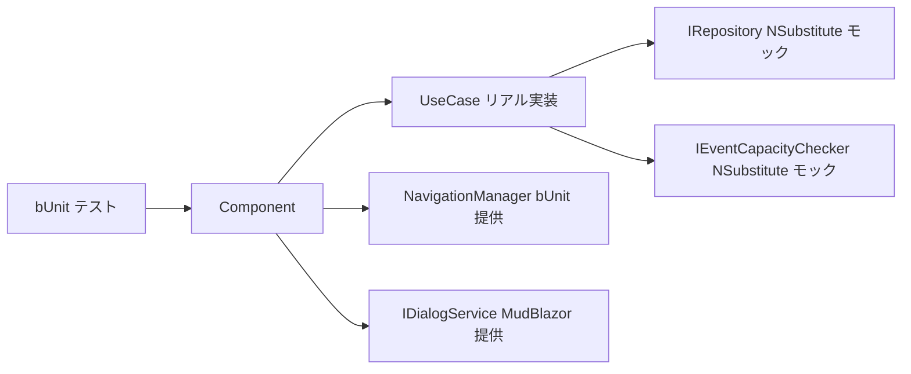

# Web 層 Blazor コンポーネント テスト仕様書

> 対象プロジェクト: `EventRegistration.Web.Tests`
> 関連 Issue: [#12](https://github.com/runceel/ai-dev-dotnetapp/issues/12)
> テストフレームワーク: MSTest + bUnit 2.7.x + NSubstitute

---

## 概要

Web 層の Blazor コンポーネントに対する bUnit ユニットテストの仕様を定義する。
UseCase のリポジトリインターフェースを NSubstitute でモックし、コンポーネントの UI ロジックを検証する。

### テストカバレッジ一覧

| テストクラス | 対象 | テスト数 | 主な検証観点 |
|---|---|---|---|
| EventListTests | EventList.razor | 6 | 空リスト、一覧表示、詳細遷移 |
| EventCreateTests | EventCreate.razor | 5 | フォーム表示、送信成功/エラー |
| EventDetailTests | EventDetail.razor | 5 | 未発見、詳細表示、残枠計算 |
| ParticipantListTests | ParticipantList.razor | 6 | 空表示、確定/待ち表示、キャンセルボタン |
| RegistrationFormTests | RegistrationForm.razor | 6 | フォーム要素、登録成功/失敗 |
| EventCapacityCheckerAdapterTests | EventCapacityCheckerAdapter.cs | 2 | 存在/非存在イベント |

---

## 1. テスト基盤

### プロジェクト構成

```
src/tests/EventRegistration.Web.Tests/
  Adapters/
    EventCapacityCheckerAdapterTests.cs
  Components/Pages/Events/
    EventListTests.cs
    EventCreateTests.cs
    EventDetailTests.cs
    ParticipantListTests.cs
    RegistrationFormTests.cs
```

### 依存パッケージ

| パッケージ | バージョン | 用途 |
|---|---|---|
| bunit | 2.7.* | Blazor コンポーネントテスト |
| NSubstitute | 5.* | モック生成 |
| MudBlazor | 9.4.0 | UI コンポーネントライブラリ |

### 共通セットアップパターン

各テストクラスは `BunitContext` を継承し、`[TestInitialize]` で以下を設定する。

- リポジトリインターフェースの NSubstitute モック登録
- UseCase の DI 登録（リアル実装 + モックリポジトリ）
- `Services.AddMudServices()` による MudBlazor サービス登録
- `JSInterop.Mode = JSRuntimeMode.Loose` による JS 呼び出しの緩和

---

## 2. コンポーネント別テスト仕様

### EventList.razor

| テストメソッド | 検証内容 |
|---|---|
| NoEvents_ShowsEmptyMessage | イベント 0 件時に案内メッセージを表示 |
| WithEvents_ShowsEventNames | イベント名が一覧に表示される |
| WithEvents_ShowsCapacity | 定員が表示される |
| WithEvents_ShowsDescription | 説明文が表示される |
| ClickEventCard_NavigatesToDetail | カードクリックで `/events/{id}` に遷移 |
| ShowsCreateButton | 「新しいイベントを作成」ボタンが表示される |

### EventCreate.razor

| テストメソッド | 検証内容 |
|---|---|
| InitialRender_ShowsFormTitle | フォームタイトルが表示される |
| InitialRender_ShowsSaveButton | 保存ボタンが表示される |
| InitialRender_ShowsCancelLink | キャンセルリンクが表示される |
| SubmitSuccess_NavigatesToEventDetail | 送信成功時に詳細画面へ遷移 |
| SubmitError_ShowsErrorMessage | 送信失敗時にエラーメッセージを表示 |

### EventDetail.razor

| テストメソッド | 検証内容 |
|---|---|
| EventNotFound_ShowsWarning | 存在しないイベントで警告を表示 |
| EventNotFound_ShowsBackLink | 「一覧に戻る」リンクを表示 |
| EventFound_ShowsEventName | イベント名を表示 |
| EventFound_ShowsCapacityAndRemainingSlots | 定員と残枠を正しく計算・表示 |
| EventFound_ShowsDescription | 説明文を表示 |

### ParticipantList.razor

| テストメソッド | 検証内容 |
|---|---|
| NoRegistrations_ShowsEmptyMessage | 参加者 0 名時に案内メッセージを表示 |
| WithConfirmedRegistrations_ShowsConfirmedSection | 確定セクションに名前・人数を表示 |
| WithWaitListedRegistrations_ShowsWaitListedSection | 待ちセクションに名前・人数を表示 |
| WithMixedRegistrations_ShowsBothSections | 両セクションを同時に表示 |
| ShowsEmailAddresses | メールアドレスを表示 |
| ShowsCancelButtons | キャンセルボタンを表示 |

### RegistrationForm.razor

| テストメソッド | 検証内容 |
|---|---|
| InitialRender_ShowsFormElements | 「参加登録」ボタンを表示 |
| InitialRender_ShowsNameAndEmailLabels | 参加者名・メールアドレスラベルを表示 |
| SubmitSuccess_Confirmed_ShowsSuccessMessage | 確定登録時に成功メッセージを表示 |
| SubmitSuccess_WaitListed_ShowsWarningMessage | 待ち登録時に警告メッセージを表示 |
| SubmitFailure_DuplicateEmail_ShowsErrorMessage | 重複メール時にエラーを表示 |
| SubmitFailure_EventNotFound_ShowsErrorMessage | イベント未発見時にエラーを表示 |

### EventCapacityCheckerAdapter

| テストメソッド | 検証内容 |
|---|---|
| EventExists_ReturnsCapacityInfo | 存在するイベントの定員情報を返す |
| EventNotExists_ReturnsNull | 存在しないイベントで null を返す |

---

## 3. モック戦略



UseCase は concrete sealed クラスのため直接モックできない。リポジトリインターフェースをモックし、UseCase はリアル実装を DI 登録する。これにより UseCase のビジネスロジックも含めた統合的なコンポーネントテストとなる。
