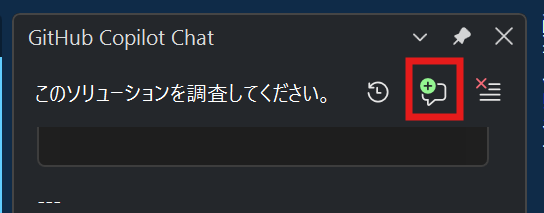
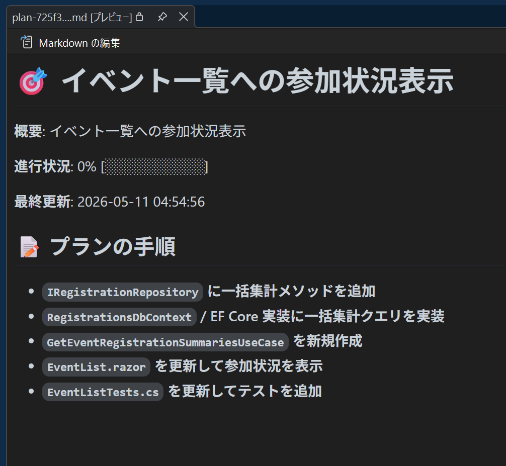

# Visual Studio 2026 GitHub Copilot Agent Mode ハンズオン

> 対象: EventRegistration リポジトリを題材にした 30 分ハンズオン  
> 想定環境: Visual Studio 2026 + GitHub Copilot Agent mode  
> 主題: 既存 .NET アプリケーションの調査、計画、実装、検証を Agent mode で進める

---

## このハンズオンで行うこと

このハンズオンでは、Visual Studio 2026 の GitHub Copilot Agent mode を使って、初めて見る既存 .NET ソリューションに小さな機能追加を行います。

題材はイベント参加登録システムです。イベント一覧画面のカードに、参加確定者数、残り枠数、満席表示、キャンセル待ち有無を追加します。

この資料は、参加者が自分の Visual Studio 2026 上でそのまま手順を進められるように書かれています。各ステップでは、Agent mode に貼り付けるプロンプト、確認する結果、うまくいかない場合の調整方法を示します。

### 最低限達成すること（必須）

30 分以内に、次の 2 点を完了させることを最優先にしてください。

1. **参加確定者数と残り枠数の表示** — イベント一覧カードに、`RegistrationStatus.Confirmed` の件数と「定員 − 参加確定者数」の残り枠数を表示する
2. **ビルドとテストが通る状態にする** — `dotnet build` と `EventRegistration.Web.Tests` のテストがすべて成功していることを確認する

この 2 点が済んでいれば、ハンズオンとして十分な達成とみなします。

### 時間があればやること（任意）

上記が終わって時間が残っている場合は、次の項目を追加してください。

| 項目 | 内容 |
|------|------|
| 満席バッジ | 残り枠数が 0 のカードに満席表示を追加する |
| キャンセル待ち表示 | `RegistrationStatus.WaitListed` が 1 件以上ある場合にキャンセル待ち中と表示する |
| 画面での目視確認 | Aspire AppHost を起動し、実際のブラウザ画面で表示を確認する |
| レビュー向け説明 | 変更内容と確認結果を Agent に整理させ、PR 説明文の下書きを作る |

---

## ゴール

ハンズオン終了時点で、次の状態を目指します。

| ゴール | 内容 |
|------|------|
| 既存コードを調査できる | Agent にソリューション構成、画面、UseCase、テストの場所を調べさせる |
| 実装前に計画を確認できる | いきなりコードを変更させず、変更対象とテスト方針を確認する |
| Agent に実装を依頼できる | 既存パターンに合わせて UI とテストを更新させる |
| ビルドとテストを確認できる | 変更後にビルド、テスト、必要に応じて画面表示を確認する |
| 変更内容を説明できる | レビュー向けに、変更点と確認結果を Agent に整理させる |

重要なのは、Agent mode にすべてを一度に任せないことです。調査、計画、実装、検証を分けて依頼すると、既存プロジェクトでも安全に変更を進めやすくなります。

---

## 前提条件

開始前に、次の状態になっていることを確認してください。

| 項目 | 内容 |
|------|------|
| IDE | Visual Studio 2026 |
| Copilot | GitHub Copilot Agent mode が利用可能 |
| SDK | .NET 10 SDK |
| ソリューション | `EventRegistration.slnx` を Visual Studio 2026 で開いている |
| 確認に使う画面 | Solution Explorer、GitHub Copilot Chat、Test Explorer、Aspire AppHost |

Visual Studio 2026 上で、次の点も確認しておきます。

- Solution Explorer にソリューションと各プロジェクトが表示されている
- `EventRegistration.AppHost` をスタートアップ対象として選択できる
- Build メニューからソリューションのビルドを実行できる
- Test Explorer に `EventRegistration.Web.Tests` のテストが表示される

---

## 作業の流れ

このハンズオンは、次の順番で進めます。

| ステップ | 内容 | 目安 | 区分 |
|------|------|------|------|
| 1 | Agent に既存コードを調査させる | 5 分 | 必須 |
| 2 | 実装計画だけを作らせる | 5 分 | 必須 |
| 3 | 計画を確認し、疑問点や誤りを修正する | 3 分 | 必須 |
| 4 | Agent に実装とテスト更新を依頼する | 9 分 | 必須 |
| 5 | ビルドとテストを確認する | 5 分 | 必須 |
| 6 | 画面表示を目視確認する | 3 分 | 任意 |
| 7 | レビュー向け説明を作らせる | 3 分 | 任意 |

時間が足りない場合は、ステップ 6〜7 を省略し、ステップ 5（ビルドとテストの確認）の完了を最低限のゴールとして扱ってください。

---

## 題材にする変更

このハンズオンでは、イベント一覧画面のカードに「いまこのイベントにどれくらい人が集まっているか」が一目で分かる表示を追加します。現状のカードはイベント名や説明、定員などの静的な情報しか出していないため、参加者目線では「まだ申し込めるのか」「もう満席なのか」がカードを見ただけでは判断できません。今回の変更では、この情報不足を解消することを目的とします。

具体的には、カードの中に **参加確定者数** を表示し、定員と突き合わせて **残り枠数** を計算して見せます。残り枠数は単純に「定員 − 参加確定者数」で求めますが、キャンセル待ちの状況によっては理論上マイナスになり得るため、0 未満には丸めずに 0 として扱う必要があります。さらに、残り枠数が 0 になったイベントには **満席バッジ** を、`RegistrationStatus.WaitListed` の登録が 1 件以上あるイベントには **キャンセル待ち中の表示** を加えて、状態をひと目で区別できるようにします。参加確定者数のカウント対象は `RegistrationStatus.Confirmed` のみで、キャンセル待ちは残り枠数の計算には含めない、というのが今回採用するルールです。

この題材では、Events モジュール側のイベント情報と、Registrations モジュール側の登録ステータスという、Modular Monolith における異なるモジュールの情報を 1 画面で組み合わせる必要がある一方で、既存のイベント一覧画面、UseCase、Repository、bUnit テストにすべての足場が揃っています。Agent には、まずそれらの既存実装を調査させ、新しいプロジェクトや大掛かりな抽象化を追加せずに、既存パターンの延長線上で UI とテストを更新してもらう、という流れを体験してもらいます。

### データ取得に関する注意

イベント一覧画面では複数イベントの参加状況を同時に表示します。そのため、1 イベント単位で取得する方法と、複数イベント分をまとめて取得する方法のどちらを採用するかを、実装前に確認します。

Agent には、既存コードを調査したうえで、次の観点を含めてデータ取得方針を提案させてください。

| 観点 | 確認内容 |
|------|----------|
| 取得単位 | 1 イベント単位で取得するのか、複数イベント分をまとめて取得するのか |
| 既存実装との整合性 | 既存 UseCase / Repository の責務に合っているか |
| パフォーマンス | 複数イベント表示時に不要な繰り返し取得が発生しないか |
| 変更範囲 | 新しい Repository メソッドやテスト追加が必要か |

このハンズオンでは、Agent が提案した方針をそのまま採用するのではなく、Step 3 で選択理由と影響範囲を確認してから実装に進みます。

なお、Analytics モジュールにも `EventStatistics` という Read モデルがありますが、これはドメインイベント履歴ベースの集計値であり、「現在の `RegistrationStatus.Confirmed` 件数」とは定義が異なります。今回の用途には使わず、**Registrations モジュールから直接取得する方針**を採用してください。

---

## Step 1: Agent に既存コードを調査させる

まず、まだコードを変更させずに、Agent に関連箇所を調べてもらいます。

Visual Studio の GitHub Copilot Chat を Agent mode に切り替え、次のプロンプトを貼り付けてください。

```text
このソリューションを調査してください。

知りたいこと:
- 主要なプロジェクト構成
- アーキテクチャの方針
- Events / Registrations モジュールの役割
- イベント一覧画面の実装場所
- 参加登録情報を取得している UseCase や Repository
- 関連するテストの場所

まだコードは変更しないでください。
調査結果だけを簡潔にまとめてください。
```

### 確認すること

Agent の回答で、少なくとも次の情報が出ているか確認します。

| 確認項目 | 期待する内容 |
|----------|--------------|
| イベント一覧画面 | `EventList.razor` など、一覧画面の実装場所が示されている |
| 参加登録情報 | Registrations 側の UseCase または Repository が示されている |
| テスト | `EventListTests.cs` など、関連テストの場所が示されている |
| 設計方針 | Modular Monolith / Clean Architecture の境界に触れている |

情報が不足している場合は、次のように追加で聞いてください。

```text
イベント一覧画面に参加登録情報を表示する場合に、どの既存 UseCase とテストを使うべきかをもう少し具体的に調べてください。
まだコードは変更しないでください。
```

---

## Step 2: 実装計画だけを作らせる

次に、コードを変更する前に実装計画を作らせます。

### スレッドを切り替える

Step 2 に進む前に、Visual Studio の GitHub Copilot Chat にある **「新しいスレッドを作成する」** ボタン (GitHub Copilot Chat ウィンドウの右上にある緑色の + のあるボタンです) を選択して、新しいスレッドを開いてください。Step 1 の調査セッションとは別のスレッドで、これから実装観点での調査と計画を行います。



スレッドを切り替えてコンテキストをクリアすることには、次のようなメリットとデメリットがあります。

- **メリット**: Step 1 の調査で読み込まれた大量のファイル内容や試行錯誤のログがコンテキストから外れるため、Agent が「今回やりたい変更」に集中しやすくなり、計画フェーズの精度が安定します。
- **デメリット**: Step 1 で Agent が掴んだ具体的なファイルパスやクラス名などの文脈は引き継がれないため、Step 2 では実装観点で改めて調査してもらう必要があります。

今回はノイズを切り離して計画の精度を優先する方針で進めます。

### 実装観点で改めて調査と計画を依頼する

新しいスレッドで、次のプロンプトを貼り付けてください。Step 1 の調査結果をそのまま引き継ぐのではなく、実装に必要な範囲で Agent に再度コードを読ませてから計画を立ててもらいます。

```text
イベント一覧画面に、各イベントの参加状況を表示したいです。

表示したい内容:
- 参加確定者数
- 残り枠数
- 満席かどうか
- キャンセル待ちがあるかどうか

既存の Modular Monolith / Clean Architecture / MudBlazor / bUnit の方針に従ってください。

データ取得の制約:
- 参加確定者数とキャンセル待ち件数は Registrations モジュールから取得してください
- Analytics モジュールの EventStatistics は、ドメインイベント履歴ベースの集計値で、
  「現在の RegistrationStatus 件数」とは定義が異なるため、今回は使用しないでください
- 一覧画面では複数イベントを表示します

まず、実装に必要な範囲でソリューションを調査してください。
- イベント一覧画面の実装場所
- 参加登録情報を取得している既存の UseCase / Repository
- 関連する bUnit テストのセットアップ

調査が終わったら、Visual Studio 2026 の Planning ツールを使って実装計画を作成してください。
まだコードは変更しないでください。

計画には次を含めてください:
- 変更対象ファイル
- データ取得方針とその理由
- 採用しなかった方針がある場合は、その理由
- テスト方針（既存テストセットアップへの影響を含む）
- 実装上の注意点
```

### 計画例

次の画像は、同じ題材でドライランしたときに Agent が生成した計画の例です。実際の出力は環境や既存コードの状態によって変わりますが、変更対象ファイル、データ取得方針、テスト方針が整理された形で出力されることを確認できます。



---

## Step 3: 計画を確認し、疑問点や誤りを修正する

このステップの目的は、実装範囲を変えることではなく、計画の不明点を質問し、方針違いや誤りを修正してから実装に進むことです。

次の観点で点検してください。

| 観点 | 確認内容 |
|------|----------|
| 変更範囲 | 主な変更がイベント一覧画面、既存 UseCase / Repository、既存テストの範囲に収まっているか |
| 設計 | Events モジュールから Registrations モジュールへ不自然な直接依存を追加していないか |
| 再利用 | 既存の UseCase、Repository、テストセットアップを使っているか |
| データ取得方針 | 複数イベントを表示する前提で、取得方法と選択理由が説明されているか |
| パフォーマンス | 不要な繰り返し取得が発生しない方針、または発生する場合の理由が説明されているか |
| モジュール選択 | Analytics モジュールではなく Registrations モジュールから取得しているか |
| テスト | bUnit テストの追加または更新が計画に含まれているか |
| テスト依存 | 追加・変更する UseCase / Repository に応じたテストセットアップ変更が含まれているか |
| 過剰さ | 実装範囲に対して、新しいプロジェクト、大きなリファクタリング、不要な抽象化が含まれていないか |

疑問点がある場合はそれを Agent に質問してください。実装前に確認できれば形式は問いません。例:

```text
次の点が不明です。実装前に説明してください。

- なぜその UseCase / Repository を使うのですか
- データ取得方針として、他に検討した方法はありますか
- テストではどの依存関係をモックしますか
- 実装上の注意点は何ですか

まだコードは変更しないでください。
```

方針違いや誤りがある場合は修正を依頼してください。指摘内容に応じてプロンプトを組み立ててください。例:

```text
計画を修正してください。

- Analytics モジュールは使わず、Registrations モジュールから取得してください
- 新しいプロジェクトや大きな抽象化は追加しないでください
- 修正後の計画では、変更対象ファイル、データ取得方針、テスト方針、実装上の注意点を改めて整理してください

まだコードは変更しないでください。
```

疑問点や誤りが解消したら、Step 4 に進みます。

---

## Step 4: Agent に実装を依頼する

計画が妥当だと判断できたら、実装を依頼します。

```text
この計画で実装してください。

既存のコードスタイルに合わせてください。
必要な bUnit テストも追加または更新してください。
実装後に、変更内容を簡潔に報告してください。
```

### 実装中に確認すること

Agent が提案する差分を確認しながら進めます。特に次の点を見てください。

| 確認項目 | 見るポイント |
|----------|--------------|
| UI の変更 | イベント一覧カードに参加状況が自然に追加されているか |
| データ取得 | 既存の登録情報取得ロジックを無理なく使っているか |
| 非同期処理 | Blazor の非同期描画や初期化処理が破綻していないか |
| テスト | 参加確定者数、残り枠数、満席、キャンセル待ちの検証が追加されているか |
| 影響範囲 | 関係ないファイルや大きなリファクタリングが含まれていないか |

差分が大きくなりすぎた場合は、実装を止めて次のように依頼します。

```text
変更範囲を小さくしてください。
今回は EventList.razor と EventListTests.cs を中心にしてください。
新しい抽象化や大きなリファクタリングは行わず、既存 UseCase を使って実装してください。
```

---

## Step 5: ビルドとテストを確認する

実装が終わったら、Agent にビルドとテストの確認を依頼します。

```text
ビルドとテストを実行して確認してください。
失敗した場合は原因を調査して修正してください。

確認結果を簡潔に報告してください。
```

Visual Studio では、Build 出力と Test Explorer でも結果を確認してください。

参加者自身でも、Visual Studio 2026 上で次の順に確認します。

1. Build メニューからソリューションをビルドする
2. Error List に新しいエラーが出ていないことを確認する
3. Output ウィンドウでビルド結果を確認する
4. Test Explorer で `EventRegistration.Web.Tests` のテストを実行する
5. 失敗したテストがある場合は、失敗メッセージを Agent に渡して原因調査と修正を依頼する

### 期待する結果

| 確認項目 | 期待する状態 |
|----------|--------------|
| ビルド | エラーがない |
| テスト | `EventRegistration.Web.Tests` のテストが成功する |
| 追加テスト | イベント一覧の参加状況表示に関するテストが含まれている |
| 失敗時の対応 | Agent が原因を説明し、必要な修正を提案または実施している |

---

## Step 6: 画面で確認する

時間があれば、Aspire AppHost からアプリを起動して画面を確認します。

Visual Studio で `EventRegistration.AppHost` をスタートアップ対象にして、実行ボタンから起動してください。

Aspire ダッシュボードが開いたら、`web` リソースのエンドポイントから Web アプリを開きます。

イベント一覧画面で、次の表示を確認してください。

- 参加確定者数が表示される
- 残り枠数が表示される
- 残り枠数が 0 のイベントで満席表示が出る
- キャンセル待ちがあるイベントでキャンセル待ち表示が出る
- 既存のイベント名、説明、定員、詳細遷移が壊れていない

---

## Step 7: レビュー向け説明を作らせる

最後に、今回の変更内容をレビュー向けに整理します。

```text
今回の変更をレビュー担当者向けにまとめてください。

含めてほしい内容:
- 変更したファイル
- 設計上の判断
- 追加または更新したテスト
- 確認結果
- 残っている注意点

簡潔に説明してください。
```

この出力は、Pull Request の説明文やチーム共有の下書きとして使えます。

---

## 困ったとき

### Agent がすぐにコードを変更しようとする

調査や計画だけをしてほしいときは、プロンプトの最後に次の一文を入れてください。

```text
まだコードは変更しないでください。
```

### Agent の計画が大きすぎる

新しいプロジェクト、大きな抽象化、広範囲のリファクタリングが出てきた場合は、次のようにスコープを絞ります。

```text
イベント一覧画面、既存 UseCase、既存 bUnit テストを中心にしてください。
新しいプロジェクトや大きな設計変更は行わないでください。
```

### Agent が Analytics モジュールを使おうとする

Analytics モジュールの `EventStatistics` は、ドメインイベント履歴に基づく Read モデルです。「現在の `RegistrationStatus.Confirmed` 件数」とは定義が異なるため、今回の用途には使えません。

Agent が `GetEventStatisticsUseCase` を使おうとした場合は、次のように修正を依頼してください。

```text
Analytics モジュールの EventStatistics は使わないでください。
Registrations モジュールの IRegistrationRepository または
GetRegistrationsByEventUseCase を使って、
RegistrationStatus.Confirmed と WaitListed の件数を直接取得してください。
```

### テストで IRegistrationRepository のモック登録を忘れている

既存の `EventListTests` は `IEventRepository` のみをモックしています。参加状況表示を追加すると `IRegistrationRepository` または `GetRegistrationsByEventUseCase` のセットアップが必要です。

```text
EventListTests.cs に IRegistrationRepository のモック登録と
DI 設定を追加してください。
既存の IEventRepository モックパターンに合わせてください。
```

### テストが失敗する

Agent に、失敗したテスト名とエラーメッセージを読ませてください。

```text
このテスト失敗の原因を調査してください。
既存テストの書き方に合わせて修正案を出してください。
必要なら修正してください。
```

特に次の点を確認すると解決しやすくなります。

| 確認項目 | 内容 |
|----------|------|
| DI 登録 | UseCase と Repository モックがテストで登録されているか |
| モックデータ | Confirmed と WaitListed の登録データがテストに用意されているか |
| 非同期描画 | 必要に応じて `WaitForAssertion` など既存テストの待機パターンを使っているか |
| MudBlazor | `AddMudServices()` や JSInterop 設定が既存テストに合わせられているか |

### 時間が足りない

冒頭の「最低限達成すること」を参照してください。参加確定者数と残り枠数の表示、ビルドとテストの確認が完了していれば十分です。

満席表示、キャンセル待ち表示、画面目視確認、レビュー向け説明は後から追加する課題として扱えます。

---

## 持ち帰るポイント

Agent mode は、いきなり全作業を任せるためだけの機能ではありません。

既存アプリケーションでは、次の順番で依頼すると安全に進めやすくなります。

1. 調査だけを依頼する
2. 実装計画だけを作らせる
3. 人間が計画を確認してスコープを調整する
4. 実装とテスト更新を依頼する
5. ビルド、テスト、画面表示を確認する
6. 変更内容を説明させる

この流れを使うと、初見のコードベースでも「どこを触るべきか」「既存パターンは何か」「どのテストを更新すべきか」を Agent と一緒に確認しながら進められます。

---

## 参考リンク

- [README](../README.md)
- [アーキテクチャ設計](../docs/architecture.md)
- [イベント参加登録システム仕様書](../docs/event-registration-system-spec.md)
- [UI Shell 設計](../docs/ui-shell-design.md)
- [Web コンポーネントテスト方針](../docs/tests/web-component-tests.md)
